# docker_gitlab_example1

## 概要
* 久しぶりに GitLab を試してみたくなったので Docker Compose で動かしてみた。
* gitlab-ce:17.3.2-ce.0

GitLab日本語マニュアル - GitLab Dockerイメージ - Docker Composerを使ったGitLabのインストール  
https://gitlab-docs.creationline.com/ee/install/docker.html  

gitlab/gitlab-ce  
https://hub.docker.com/r/gitlab/gitlab-ce/tags  

## TODO
* リモート開発  
  https://gitlab-docs.creationline.com/ee/user/project/remote_development/index.html

## 詳細

### 起動
```
docker compose up
```
※諸々終わるまで待つ

しばらく待つと以下などの大量のログが周期的に流れるようになるので、そしたらたぶん完了
```
web-1  | ==> /var/log/gitlab/gitlab-exporter/current <==
web-1  | 2024-09-12_12:02:13.16301 ::1 - - [12/Sep/2024:12:02:13 UTC] "GET /ruby HTTP/1.1" 200 1085
web-1  | 2024-09-12_12:02:13.16307 - -> /ruby
web-1  | 2024-09-12_12:02:16.74248 ::1 - - [12/Sep/2024:12:02:16 UTC] "GET /sidekiq HTTP/1.1" 200 507
web-1  | 2024-09-12_12:02:16.74251 - -> /sidekiq
web-1  | 2024-09-12_12:02:24.37088 ::1 - - [12/Sep/2024:12:02:24 UTC] "GET /database HTTP/1.1" 200 1671
web-1  | 2024-09-12_12:02:24.37093 - -> /database
```

### アクセス
http://localhost:8080  
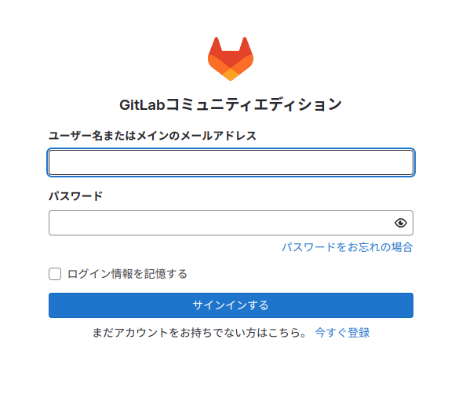

### ログイン
ユーザー名: root  
パスワードは以下のコマンドで取得
```
docker compose exec web grep 'Password:' /etc/gitlab/initial_root_password
```
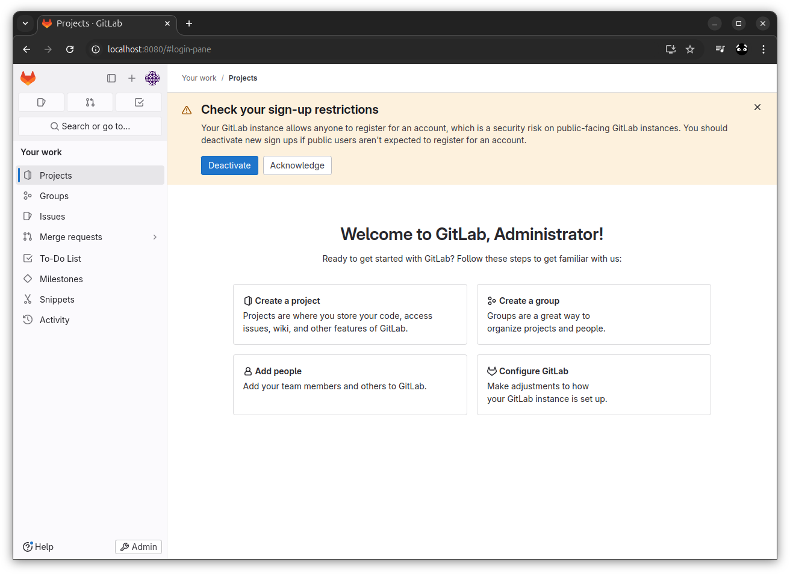

### 日本語化  
* 左上のユーザーアイコンをクリック
* ポップアップメニューから Preferences をクリック
* User Settings の Preferences に飛ぶので下までスクロール
* Localization の Language で 日本語を選択
* 画面下の Save changes をクリック
* F5 などで再読込すると反映される

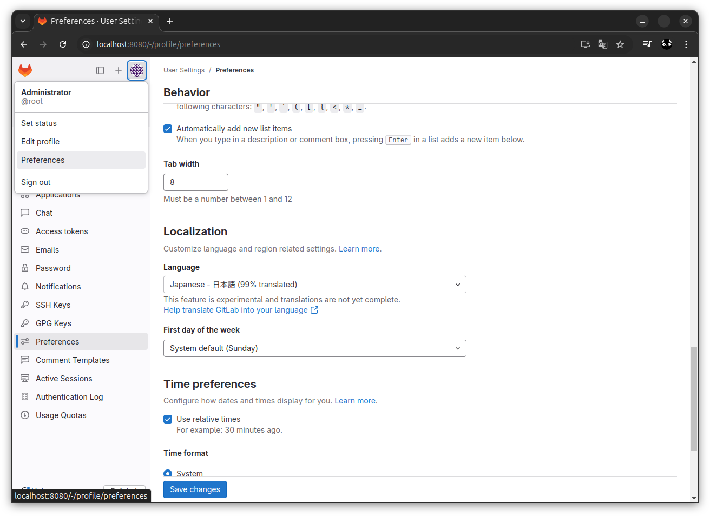  
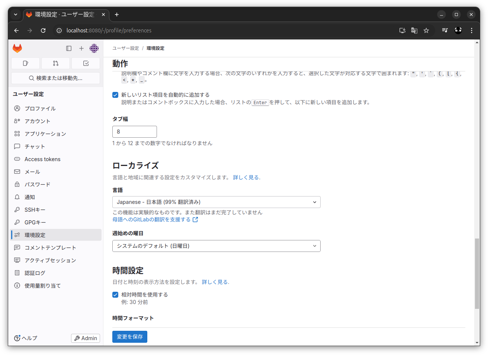  

### スクリーンショット

マイワーク  
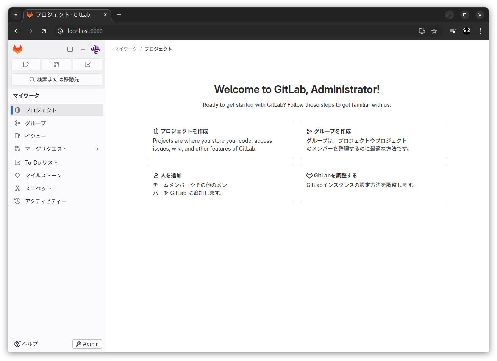

適当に作ったプロジェクト    
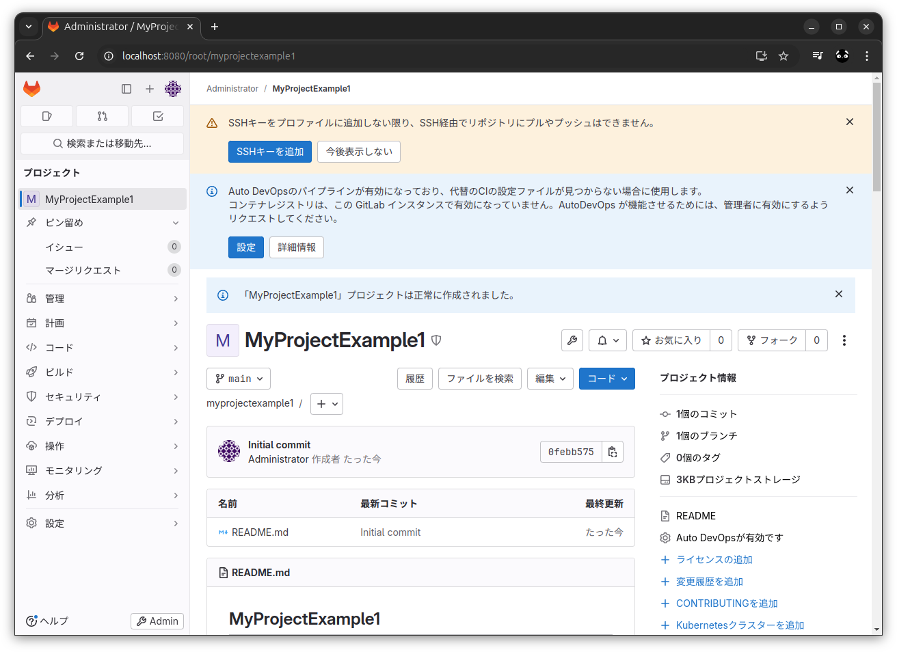

イシュー  
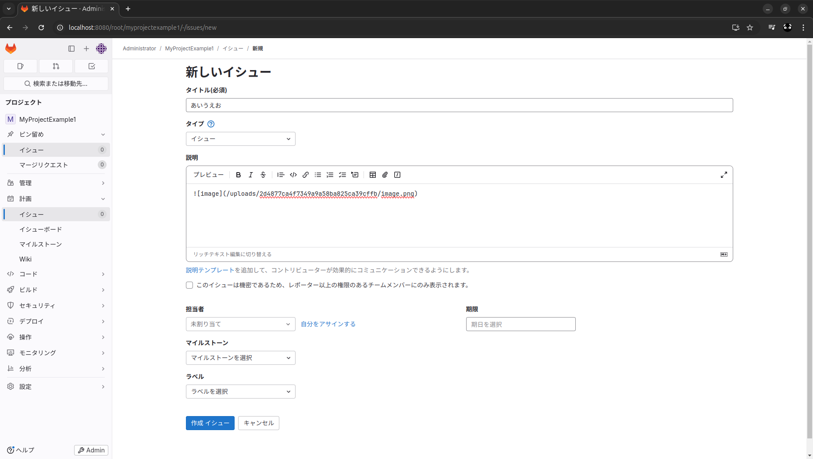  
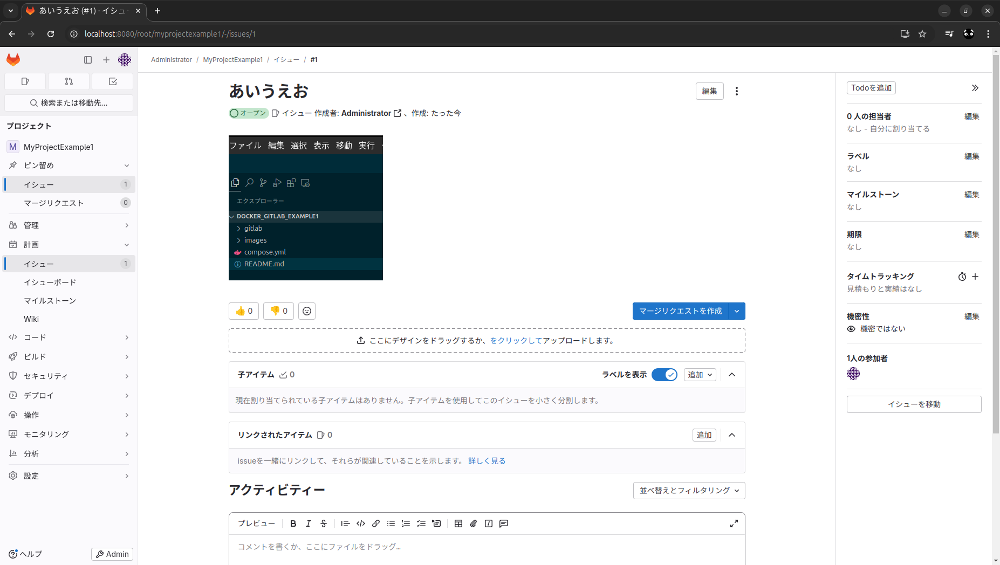  

イシューボード
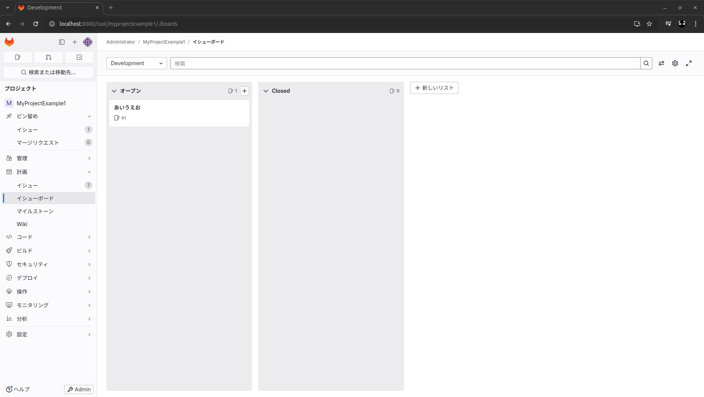

設定 - 統合  
→　Google Chat あった  
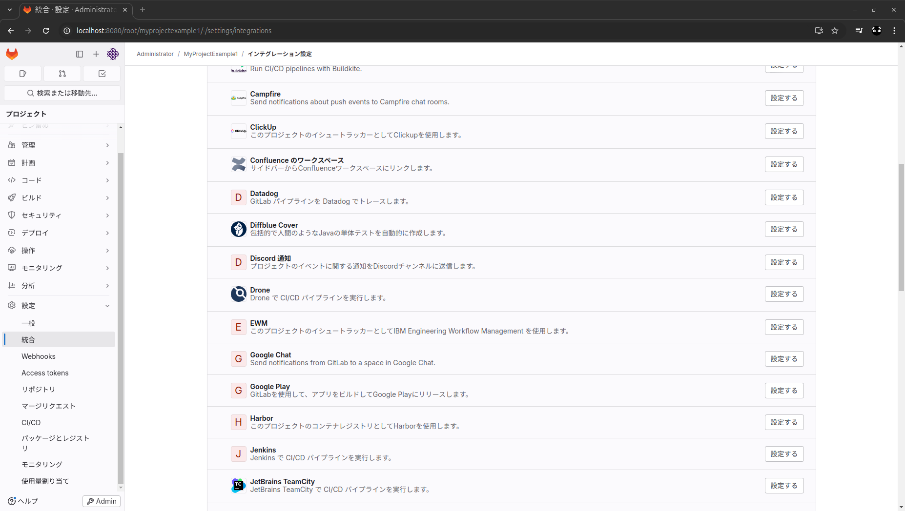  

Web IDE  
→　日本語化できるか？  
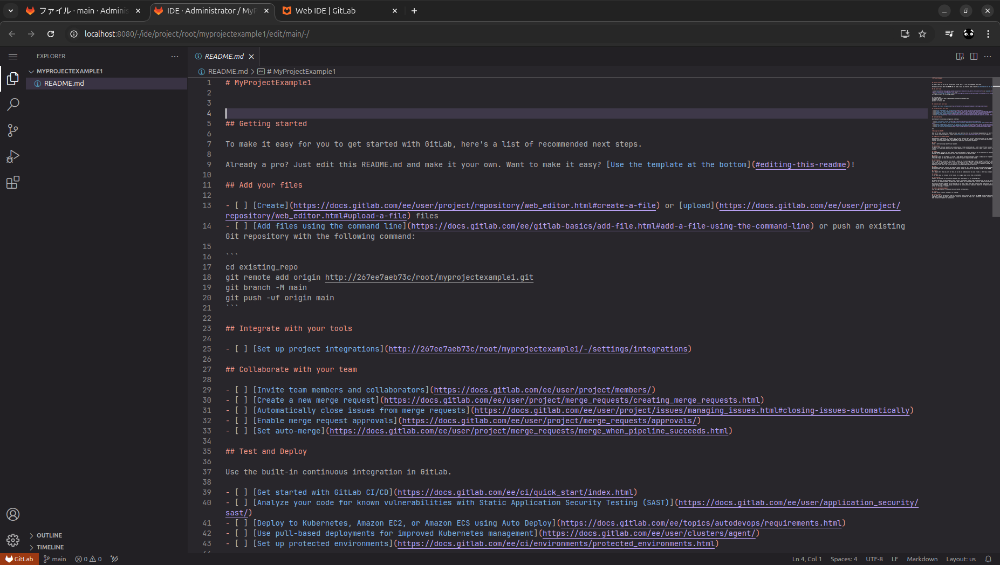  
